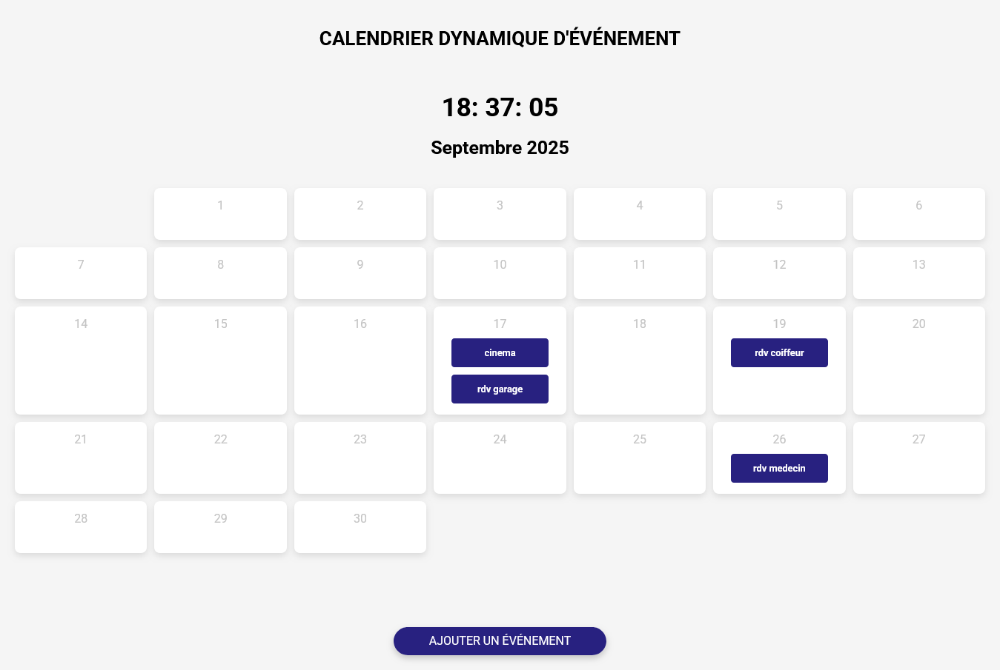

## CALENDRIER D'EVENEMENT

## Le challenge

Mon challenge a été de créer un calendrier dynamique avec affichage de l'heure qui non seulement affiche les dates, mais permet également aux utilisateurs d'ajouter, de modifier et de supprimer facilement des événements.
j'ai tiré partie de la puissance de JavaScript pour gérer les interactions des utilisateurs, manipuler le DOM et gérer efficacement les données d'événements.

## Démonstration

Lien vers le projet : https://aperbet56.github.io/calendrier_dynamique_devenement/

## Développez avec

- Utilisation des balises sémantiques HTML5
- CSS3
- Flexbox
- Grid
- Animations CSS
- Page web responsive
- Desktop first
- Utilisation d'un normaliseur : le fichier normalize.css
- Importation de la police Roboto
- JavaScript (fonctions fléchées, écouteurs d'événements, condition if...else, boucle for...)
- Code JavaScript commenté
